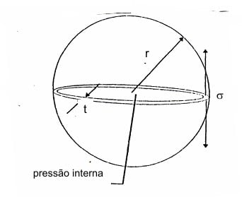
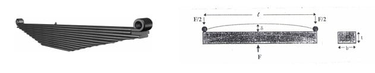

---
Classification	        :	Notes
Discipline				:	EMC029 Seleção de Materiais
Source					:	Estudo Dirigido 1.3
Description				:	Seleção de materiais para um vaso de pressão e uma mola lâmina
---

 

# Estudo Dirigido 1.3
Nome: Nicholas Gabriel Rocha Ferreira

## Seleção de materiais para um vaso de pressão
Primeiro, precisamos definir os **índices de mérito** para cada um dos cenários. Isso será feito isolando as as variáveis geométricas e de projeto das propriedades do material.

**Para a espessura da parede ($t$)**

$$\frac{\sigma_y}{S} = \frac{pr}{2t}$$

$$t = \frac{prS}{2\sigma_y}$$

**Para peso (massa $m$)**

$$m = \rho \cdot V = \rho (4\pi r^2 \cdot t)$$

$$m = \rho \left( 4\pi r^2 \cdot \frac{prS}{2\sigma_y} \right)$$

$$m = (2\pi pr^3S) \cdot \left( \frac{\rho}{\sigma_y} \right)$$

**Para o custo ($C$):**

$$C = m \cdot C_m = (2\pi pr^3S) \cdot \left( \frac{\rho \cdot C_m}{\sigma_y} \right)$$

### Índices de Desempenho dos Materiais

Isolando as variáveis dependentes exclusivamente das propriedades dos materiais, temos:

* **Índice para minimizar o peso ($I_p$):** $I_p = \frac{\rho}{\sigma_y}$ (quanto menor, mais leve).
* **Índice para minimizar o custo ($I_c$):** $I_c = \frac{\rho \cdot C_m}{\sigma_y}$ (quanto menor, mais barato).

Aplicando as fórmulas para cada material da tabela:

| Material                      | $\sigma_y$ (MPa) | $\rho$ (kg/m³) | Preço (\$/kg) | Índice de Peso ($I_p$) | Índice de Custo ($I_c$) |
| ----------------------------- | ---------------- | -------------- | ------------- | ---------------------- | ----------------------- |
| **Aço baixa liga**            | 800              | 7800           | 0,60          | 9,75                   | 5,85                    |
| **Aço baixo carbono**         | 400              | 7800           | 0,45          | 19,50                  | 8,78                    |
| **Concreto reforçado**        | 220              | 2900           | 0,29          | 13,18                  | **3,82**                |
| **Liga de alumínio 2014-T6**  | 390              | 2790           | 1,20          | 7,15                   | 8,58                    |
| **Epoxy c/ fibra de vidro**   | 118              | 1860           | 30,00         | 15,76                  | 472,88                  |
| **Epoxy c/ fibra de carbono** | 540              | 1580           | 62,00         | **2,93**               | 181,41                  |

Pela análise da tabela:

a) Para um menor peso, a melhor opção é o **Epoxy reforçado com fibra de carbono (isotrópico)**. 

b) Para o melhor custo-benefício, a melhor opção é o **Concreto reforçado**. 

**Observação adicional:** Embora tenha sido pedido para fazer a seleção do material apenas em função do peso ou do custo, seria interessante também considerar a manutenção a longo prazo, as variações de temperatura do ambiente, e as causadas pela despressurização do vaso, caso ele armazene gases.
Com essas considerações, a **Liga de alumínio 2014-T6** se apresenta um material equilibrado em relação ao peso e custo, além de possuir resistência à corrosão, baixa manutenção, tolerância a baixas temperaturas e ciclos térmicos.

 

## Seleção de materiais para uma mola-lâmina
Como a geometria da mola é fixa, a análise pode ser simplificada comparando apenas as propriedades mecânicas dos materiais.

a) Dentre os materiais apresentados, o de melhor desempenho para confeccionar uma mola de lâmina de suspensão mais rígida é o **Aço baixa liga**.

Uma suspensão mais rígida se traduz em um material com maior módulo de elasticidade ($E$). Os dois materiais com maior $E$ são o **Aço baixa liga (210 GPa)** e o **Aço baixo carbono (205 GPa)**. Além disso, para um melhor desempenho, também deve-se escolher um material com maior limite de escoamento ($\sigma$) para evitar deformação permanente. O aço baixa liga tem o maior limite de escoamento ($900 \text{ MPa}$), garantindo que ele não sofra deformação permanente sob tensões elevadas.

b) Dentre os materiais apresentados, o de melhor custo-benefício para confeccionar uma mola de lâmina de suspensão mais rígida é o **Aço baixa liga**, assim como para melhor desempenho.

Dentre os três materiais com menor custo, a madeira de média densidade é descartada imediatamente por possuir tanto limite de escoamento ($\sigma$) e módulo de elasticidade ($E$) muito baixos, o que a torna inviável para uma mola de suspensão. Isso faz com que comparemos apenas o aço baixo carbono e o aço baixa liga.

A suspensão tem um volume de $0.008 \cdot 0.08 \cdot 1 = 0.00064 \text{ m}^3$, que para a densidade de $7800 \text{ kg/m}^3$ resulta em uma massa de aproximadamente 5kg. O custo do aço baixo carbono é de $5 \text{ kg} \cdot 0.45 \text{ dólar/kg} = \$2.25$, enquanto o custo do aço baixa liga é de $5 \text{ kg} \cdot 0.60 \text{ dólar/kg} = \$3.00$. Isso mostra que por apenas alguns centavos de dólares a mais, pode-se obter um material com mais que o dobro do limite de escoamento.

 

# Enunciado
## Seleção de materiais para um vaso de pressão

Considere o vaso de pressão de paredes finas de raio $r$, espessura de parede $t$, sujeito à pressão interna $p$.

A tensão de tração $\sigma$ que atua na parede do vaso provocada pela pressão interna $p$ é dada por:

$$\sigma = \frac{pr}{2t}$$

onde $r$ é o raio do vaso e $t$ é a espessura de sua parede.

Para que o vaso não deforme plasticamente ou rompa é necessário que $\sigma \le \frac{\sigma_y}{S}$ onde $\sigma_y$ é a tensão de escoamento do material e $S$ um fator de segurança.
Sabendo que $\rho$ é a densidade do material do vaso e que sua área é $4\pi r^2$, dos materiais listados na tabela seguinte, qual seria a melhor opção para a sua fabricação quando se deseja:

a) um menor peso?
b) melhor custo-benefício?

Em ambos os casos ignore o peso próprio do vaso de pressão.

| Material                                          | $\sigma_y$ (MPa) | $\rho$ ($\text{kg/m}^3$) | Preço (dólar/kg) |
| :------------------------------------------------ | :--------------: | :----------------------: | :--------------: |
| Aço baixa liga                                    |       800        |           7800           |       0,60       |
| Aço baixo carbono                                 |       400        |           7800           |       0,45       |
| Concreto reforçado                                |       220        |           2900           |       0,29       |
| Liga de alumínio 2014-T6                          |       390        |           2790           |       1,20       |
| Epoxy reforçado com fibra de vidro (isotrópico)   |       118        |           1860           |      30,00       |
| Epoxy reforçado com fibra de carbono (isotrópico) |       540        |           1580           |      62,00       |

### Resolução completa
Para resolver esse problema de seleção de materiais, precisamos definir os **índices de mérito** (ou índices de desempenho) para cada um dos cenários solicitados. A metodologia consiste em isolar as variáveis geométricas e de projeto das propriedades do material.

Vamos desenvolver as equações para o peso e para o custo do vaso de pressão.

### Modelagem Matemática

**Para a espessura da parede ($t$):**
Sabemos que no limite do projeto, considerando o fator de segurança $S$, a tensão aplicada será igual à tensão admissível:

$$\frac{pr}{2t} = \frac{\sigma_y}{S}$$

Isolando a espessura $t$, que é a variável livre do projeto:

$$t = \frac{prS}{2\sigma_y}$$

**Para o peso (massa $m$):**
A massa do vaso é o volume do material multiplicado pela sua densidade ($\rho$). Como é um vaso de parede fina, o volume aproximado é a área da superfície ($4\pi r^2$) multiplicada pela espessura ($t$):

$$m = \rho \cdot V = \rho (4\pi r^2 \cdot t)$$

Substituindo $t$ na equação da massa:

$$m = \rho \left( 4\pi r^2 \cdot \frac{prS}{2\sigma_y} \right)$$

$$m = (2\pi pr^3S) \cdot \left( \frac{\rho}{\sigma_y} \right)$$

**Para o custo ($C$):**
O custo total é a massa multiplicada pelo preço por quilograma ($C_m$):

$$C = m \cdot C_m = (2\pi pr^3S) \cdot \left( \frac{\rho \cdot C_m}{\sigma_y} \right)$$

### Índices de Desempenho dos Materiais

Nas equações acima, o termo $(2\pi pr^3S)$ é fixo e depende apenas dos requisitos de projeto. O que vai minimizar o peso ou o custo são as frações que contêm as propriedades dos materiais.

* **Índice para minimizar o peso ($I_p$):** $I_p = \frac{\rho}{\sigma_y}$ (quanto menor, mais leve será o vaso).
* **Índice para minimizar o custo ($I_c$):** $I_c = \frac{\rho \cdot C_m}{\sigma_y}$ (quanto menor, mais barato será o vaso).

*Nota: Para facilitar os cálculos e manter a proporcionalidade, usaremos a tensão de escoamento em **MPa** e a densidade em **kg/m³**.*

### Análise dos Materiais

Aplicando as fórmulas para cada material da tabela:

| Material                      | $\sigma_y$ (MPa) | $\rho$ (kg/m³) | Preço (\$/kg) | Índice de Peso ($I_p$) | Índice de Custo ($I_c$) |
| ----------------------------- | ---------------- | -------------- | ------------- | ---------------------- | ----------------------- |
| **Aço baixa liga**            | 800              | 7800           | 0,60          | 9,75                   | 5,85                    |
| **Aço baixo carbono**         | 400              | 7800           | 0,45          | 19,50                  | 8,78                    |
| **Concreto reforçado**        | 220              | 2900           | 0,29          | 13,18                  | **3,82**                |
| **Liga de alumínio 2014-T6**  | 390              | 2790           | 1,20          | 7,15                   | 8,58                    |
| **Epoxy c/ fibra de vidro**   | 118              | 1860           | 30,00         | 15,76                  | 472,88                  |
| **Epoxy c/ fibra de carbono** | 540              | 1580           | 62,00         | **2,93**               | 181,41                  |

---

### Conclusão

Com base nos resultados calculados, as melhores opções são:

**a) Para um menor peso:**
A melhor opção é o **Epoxy reforçado com fibra de carbono (isotrópico)**. Ele possui o menor Índice de Peso ($2,93$), pois combina uma excelente resistência mecânica com uma densidade muito baixa. O vaso construído com este material será significativamente mais leve do que com os outros, tornando-o ideal para aplicações aeroespaciais ou de alta performance onde o peso é crítico.

**b) Para o melhor custo-benefício:**
A melhor opção é o **Concreto reforçado**. Ele apresenta o menor Índice de Custo ($3,82$). Embora seja um material com propriedades mecânicas modestas em relação aos aços ou compósitos (exigindo paredes mais grossas e resultando em um vaso mais pesado), o seu preço por quilograma é extremamente baixo ($0,29/kg), compensando o volume extra de material necessário e tornando a estrutura final mais econômica do ponto de vista puramente financeiro. Se o peso excessivo for um problema limitante para o projeto (apesar do baixo custo), a segunda melhor opção econômica seria o **Aço baixa liga** ($5,85$).

## Seleção de materiais para uma mola-lâmina

Existem molas de várias formas e tamanhos. Considere, por exemplo, uma mola de suspensão de caminhão. Este tipo de mola é denominado mola-lâmina e é, basicamente, uma pequena viga elástica suportada em ambas as extremidades e carregada centralmente com uma força $F$. Tem a função de absorver os impactos causados pelas irregularidades do piso e suportar o seu peso, garantindo o conforto e sua altura. Possui também a função de garantir a ligação do eixo ao chassi.

Para exercer sua função, uma mola não pode ter deformação permanente durante o uso, ou seja a máxima tensão que ela suporta dever ser menor que o seu limite de escoamento. Ignorando a influência do peso próprio da mola-lâmina, selecione, dentre os materiais apresentados abaixo qual seria o material

- de melhor desempenho para confeccionar uma mola de lâmina (a primeira do feixe) de espessura de $8\text{ mm}$, largura de $8\text{ cm}$ e comprimento de $100\text{ cm}$, quando se deseja um carro com suspensão mais rígida?
- e considerando o melhor custo benefício para a mesma suspensão?

| Material                                                | $\sigma$ ($\text{MPa}$) | $E$ ($\text{GPa}$) | $\rho$ ($\text{kg/m}^3$) | Preço ($\text{dólar/kg}$) |
| :------------------------------------------------------ | :---------------------: | :----------------: | :----------------------: | :-----------------------: |
| Aço baixa liga                                          |           900           |        210         |          7.800           |           0,60            |
| Aço baixo carbono                                       |           380           |        205         |          7.800           |           0,45            |
| Madeira de média densidade                              |           60            |         10         |           500            |           0,29            |
| Liga de alumínio 2014-T6                                |           390           |         70         |          2.790           |           1,20            |
| Epoxy reforçado comfibra de vidro - GPRP (isotrópico)   |           345           |         30         |          1.900           |           30,00           |
| Epoxi reforçado com fibra de carbono - CFRP(isotrópico) |           464           |         42         |          1.590           |           62,00           |

### Resolução completa
Para determinarmos a melhor escolha de material, precisamos analisar os requisitos do projeto baseando-se nas propriedades mecânicas e no custo.

As dimensões da mola são fixas:

* **Comprimento ($L$):** $100 \text{ cm} = 1\text{ m}$
* **Largura ($b$):** $8 \text{ cm} = 0,08\text{ m}$
* **Espessura ($h$):** $8 \text{ mm} = 0,008\text{ m}$

O volume da mola é dado por $V = L \cdot b \cdot h = 1 \cdot 0,08 \cdot 0,008 = \mathbf{0,00064 \text{ m}^3}$.

---

### Desempenho para uma suspensão mais rígida

A rigidez ($k$) de uma mola de lâmina que atua como uma viga bi-apoiada é diretamente proporcional ao seu **Módulo de Elasticidade ($E$)**. Como a geometria está fixada, para obter a suspensão mais rígida possível, precisamos do material com o maior valor de $E$.

Além disso, o enunciado destaca que a mola **não pode ter deformação permanente**, ou seja, deve operar no regime elástico. Isso significa que o material deve ter um alto **Limite de Escoamento ($\sigma$)** para suportar as forças geradas pelo veículo e pelas irregularidades do piso.

* Analisando a tabela, o material com o maior Módulo de Elasticidade ($E$) é o **Aço baixa liga (210 GPa)**.
* Ao mesmo tempo, ele também possui o maior Limite de Escoamento da tabela **($\sigma = 900 \text{ MPa}$)**, garantindo que ele não sofra deformação permanente sob tensões elevadas.

**Material de melhor desempenho:** **Aço baixa liga.**

---

### Melhor custo-benefício para a mesma suspensão

Para calcular o custo de cada mola, multiplicamos o Volume pela Densidade ($\rho$) para achar a massa em kg, e depois multiplicamos pelo Preço por kg.

* **Aço baixa liga:** Massa $= 0,00064 \text{ m}^3 \times 7.800 \text{ kg/m}^3 = 4,99 \text{ kg}$. Custo $= 4,99 \text{ kg} \times \$0,60 = \mathbf{\$2,99}$
* **Aço baixo carbono:** Massa $= 4,99 \text{ kg}$. Custo $= 4,99 \text{ kg} \times \$0,45 = \mathbf{\$2,25}$
* **Liga de Alumínio:** Massa $= 0,00064 \text{ m}^3 \times 2.790 \text{ kg/m}^3 = 1,78 \text{ kg}$. Custo $= 1,78 \text{ kg} \times \$1,20 = \mathbf{\$2,14}$
* **Madeira:** É o mais barato, mas inviável por não ter resistência ($\sigma = 60 \text{ MPa}$) ou rigidez suficientes para uma suspensão automotiva.
* **Fibras de Vidro (GPRP) e Carbono (CFRP):** Custariam aproximadamente $\mathbf{\$36,48}$ e $\mathbf{\$63,09}$ respectivamente. São opções excessivamente caras.

Embora o Alumínio e o Aço baixo carbono sejam ligeiramente mais baratos na fabricação desta peça, devemos considerar o **benefício (funcionalidade)**. Ambos têm um limite de escoamento inferior a 400 MPa, o que é menos da metade da resistência do aço baixa liga. Como molas automotivas sofrem cargas de impacto extremas, utilizar aço baixo carbono ou alumínio resultaria em uma mola que deformaria (amassaria) de forma permanente rapidamente no primeiro buraco, inutilizando a suspensão. Além do mais, o alumínio deixaria a suspensão "mole" devido ao seu baixo Módulo de Elasticidade ($E = 70 \text{ GPa}$).

**Material com melhor custo-benefício:** **Aço baixa liga.** Por apenas alguns centavos a mais que as opções estruturalmente inviáveis, ele entrega a resistência e a rigidez corretas e ainda é drasticamente mais barato que os materiais compostos (fibras).