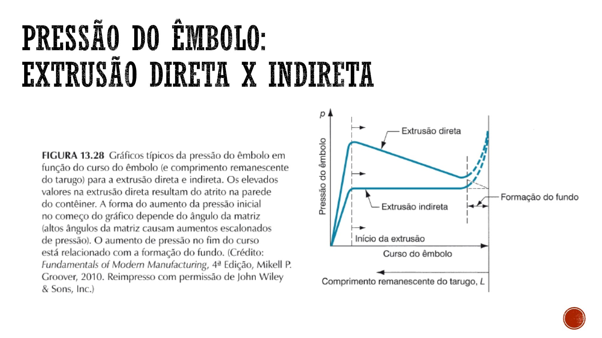
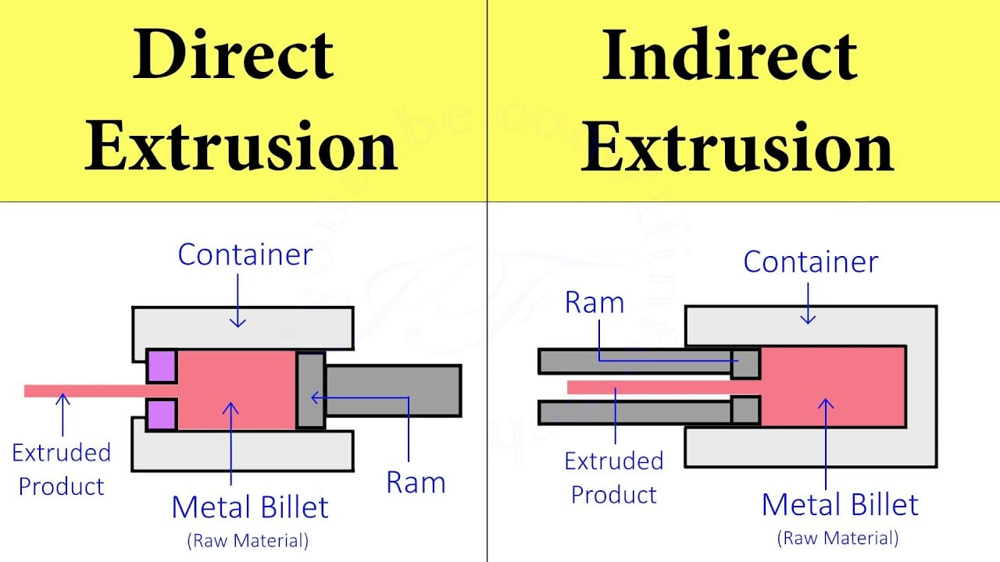

---
Classification	        :	Formula-Based Exercise
Discipline				:	EMA090 Processos Primários de Fabricação
Source					:	2025-1_P3
Description				:	Questão 2
---

# Proposition
a) Faça um gráfico da pressão de extrusão em função do deslocamento do pistão do equipamento, para a extrusão direta e indireta, e explique cada uma.

b) Explique por que ocorre o defeito de funil na extrusão direta.

# Notes

# Step-by-step

## Gemini
Aqui está a explicação detalhada para cada uma das suas dúvidas sobre os processos de extrusão.

### a) Gráfico de Pressão vs. Deslocamento do Pistão

Para desenhar o gráfico, o estudante deve colocar a **Pressão de Extrusão ($P$) no eixo Y** (vertical) e o **Deslocamento do Pistão no eixo X** (horizontal). O deslocamento geralmente é lido de trás para frente, ou seja, o início do processo é o ponto zero do deslocamento do pistão.

O gráfico terá duas curvas distintas:

**1. Curva da Extrusão Direta:**

* **Início:** A curva sobe abruptamente. Isso representa o pistão esmagando o tarugo (recalque) para preencher todo o espaço vazio dentro do contêiner.
* **Pico (Pressão de Rompimento):** A curva atinge seu ponto mais alto. Essa é a força máxima necessária para vencer o atrito estático e iniciar o fluxo do metal através da matriz.
* **Fase de Queda (Declínio):** Conforme o pistão avança, a curva apresenta uma inclinação decrescente (vai caindo gradativamente). **Explicação:** Na extrusão direta, o tarugo inteiro é empurrado e desliza contra as paredes do contêiner. Conforme o tarugo é extrudado, ele fica mais curto, diminuindo a área de contato com a parede e, consequentemente, reduzindo a força de atrito que o pistão precisa vencer.
* **Final:** Bem no final do deslocamento, a curva dá um salto rápido para cima. Isso ocorre porque o restinho do material (o "sabugo" ou *butt*) está muito fino e a resistência à deformação aumenta drasticamente perto da matriz.

**2. Curva da Extrusão Indireta:**

* **Início:** A curva sobe abruptamente, assim como na direta.
* **Pico:** A curva atinge o pico para iniciar o escoamento, mas **este pico é visivelmente menor** do que na extrusão direta.
* **Fase Constante (Platô):** Após o pico, a curva se mantém praticamente reta e horizontal durante quase todo o processo. **Explicação:** Na extrusão indireta, a matriz é empurrada contra o tarugo (ou o contêiner e o tarugo se movem juntos contra uma matriz fixa). Como não há movimento relativo entre o tarugo e a parede do contêiner, **não existe atrito nas paredes**. Portanto, a pressão necessária não diminui ao longo do processo, mantendo-se constante e menor do que a da extrusão direta.
* **Final:** Assim como na direta, há um pico de pressão no final devido ao afinamento do material restante.

---

### b) O Defeito de Funil (Rechupe Central) na Extrusão Direta

O defeito de funil, também conhecido como "rechupe central" ou *piping*, é um problema típico que ocorre na fase final da **extrusão direta**.

**Por que ocorre?**
Isso acontece devido à diferença na velocidade de escoamento do metal dentro do contêiner.

1. **Atrito e a Zona Morta:** Durante a extrusão direta, o atrito severo entre o tarugo e as paredes do contêiner, somado ao atrito na face da matriz, faz com que o material nas bordas do tarugo (periferia) se mova muito lentamente ou fique completamente estagnado (formando o que chamamos de "zona morta" de metal).
2. **Fluxo Mais Rápido no Centro:** Como as bordas estão sendo "seguradas" pelo atrito, o metal no centro do tarugo flui em direção à matriz muito mais rápido, pois encontra menos resistência.
3. **A Formação do Funil:** Quando o processo se aproxima do final (restam cerca de 1/4 a 1/3 do tarugo original), esse fluxo central muito rápido começa a "puxar" ou "sugar" o material da face traseira do tarugo para o meio.
4. **Consequência:** A superfície traseira cede para dentro, formando literalmente um buraco em forma de funil. O grande problema é que esse efeito de sucção arrasta a "casca" do tarugo — que geralmente está cheia de óxidos superficiais, lubrificantes e impurezas — direto para o centro do produto extrudado, comprometendo a integridade estrutural e mecânica da peça.

Para evitar isso, os operadores geralmente interrompem a extrusão direta antes que o defeito se forme, descartando o final do tarugo (o sabugo) que contém o início desse afunilamento.

# Answer

# Attempts
