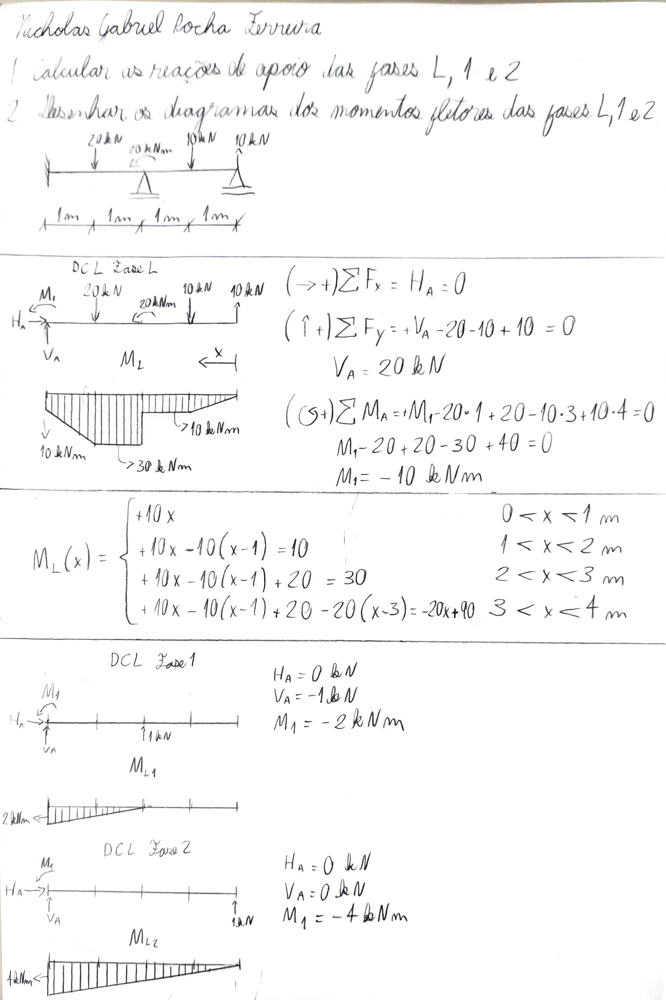

---
Classification	        :	Formula-Based Exercise
Discipline				:	EES039 Análise Estrutural
Source					:	Aula 2026-06-11
Description				:	Reações de apoio e gráficos de momentos fletores para 3 fases de uma estrutura (presença contabilizada pela entrega do exercício)
---

# Proposition

# Notes

# Step-by-step
{width=80%}

# Answer

# Attempts
