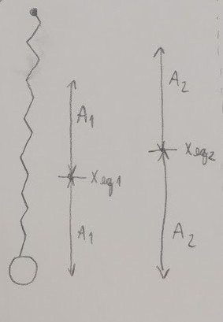

---
Classification	        :	Formula-Based Exercise
Discipline				:	FIS087 FOO
Source					:	2025-1 Lista 1
Description				:	L1-Q7
---

# Proposition

Uma bola de $1,50\,\mathrm{kg}$ e outra de $2,0\,\mathrm{kg}$ são coladas uma na outra, a mais leve embaixo da mais pesada. A bola de cima é presa a uma mola vertical ideal de constante $165\,\mathrm{N/m}$, e o sistema está vibrando verticalmente com uma amplitude de $15,0\,\mathrm{cm}$. A cola usada para juntar as bolas é velha e fraca, e cede de repente, quando as bolas estão na posição mais baixa de seu movimento.
- a) Por que é mais provável que a cola ceda no ponto mais baixo e não em qualquer outro ponto do movimento?
- b) Calcule a amplitude e a frequência das vibrações depois que a bola de baixo houver se soltado.

# Step-by-step

# Answer

a) Pois é quando a força restauradora da mola é máxima e oposta à força peso.

b) O sistema está em equilíbrio quando $F_k = F_g$:
- $-\,k\,x = -\,m\,g$
- $x = \frac{m\,g}{k}$
- $x_{\text{eq1}} = \frac{(2 + 1,5)\,\cdot 10}{165} = 21,21\,\mathrm{cm}$
- $x_{\text{eq2}} = \frac{2\,\cdot 10}{165} = 12,12\,\mathrm{cm}$
- $\omega = \sqrt{\frac{k}{m}}$
- $\omega_2 = \sqrt{\frac{165}{2}} = 9,08\,\mathrm{rad/s}$
- $A_2 = A_1 + \bigl(x_{\text{eq1}} - x_{\text{eq2}}\bigr) = 15 + (21,21 - 12,12) = 24,09\,\mathrm{cm}$

# Attempts

2025-03-26T06:00:00Z 0
2025-03-27T06:00:00Z 1
2025-04-02T06:00:00Z 1
2025-04-26T06:00:00Z 1
2025-06-03T19:39:42Z 1
