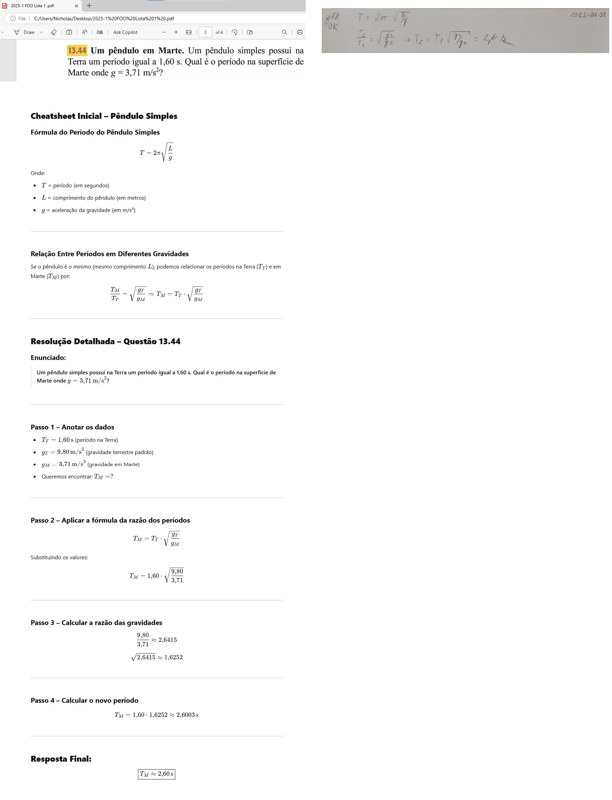

---
Classification	        :	Formula-Based Exercise
Discipline				:	FIS087 FOO
Source					:	2025-1 Lista 1
Description				:	L1-Q9
---

# Proposition

Um pêndulo em Marte. Um pêndulo simples possui na Terra um período igual a $1,60\,s$. Qual é o período na superfície de Marte onde $g = 3,71\,m/s^2$?

# Step-by-step

$T_2/T_1 = \sqrt{g_1/g_2} \to T_2 = T_1\sqrt{g_1/g_2} = 2,6\,s$

# Answer

$$
2,6s
$$

# Attempts

2025-03-26T06:00:00Z 0
2025-03-27T06:00:00Z 1
2025-03-31T06:00:00Z 1
2025-04-23T06:00:00Z 1
2025-06-03T20:42:23Z 1
