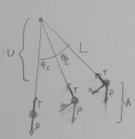

---
Classification	        :	Formula-Based Exercise
Discipline				:	FIS087 FOO
Source					:	2025-1 Lista 1
Description				:	L1-Q10
---

# Proposition

Uma pequena esfera de massa $m$ está presa a uma barra de comprimento $L$ com um pivô em sua extremidade superior, formando um pêndulo simples. O pêndulo é puxado lateralmente até um ângulo $\Theta$ com a vertical e a seguir é liberado a partir do repouso.
- a) Desenhe um diagrama mostrando o pêndulo logo após o instante em que ele é liberado. No diagrama, desenhe vetores representando as forças que atuam sobre a esfera e a aceleração da esfera. A precisão é importante! Nesse ponto, qual é a aceleração linear da esfera?
- b) Repita a parte (a) para o instante em que o pêndulo forma um ângulo $\Theta/2$ com a vertical.
- c) Repita a parte (a) para o instante em que o pêndulo está na direção vertical. Nesse ponto, qual é a velocidade linear da esfera?

# Step-by-step

- $a = g \sin(\theta)$
- $E = K + U = K_{\max} = U_{\max}$
- $K_{\max} = \frac{1}{2} m \lvert v_{\max} \rvert^2$
- $U_{\max} = m g h = m g (L - v)$
- $\cos(\theta) = \frac{v}{L} \;\to\; v = L \cos(\theta)$
- $U_{\max} = m g \bigl(L - L \cos(\theta)\bigr) = m g L (1 - \cos(\theta))$
- $K_{\max} = U_{\max}$
- $\frac{1}{2} m \lvert v_{\max} \rvert^2 = m g L (1 - \cos(\theta))$
- $v_{\max} = \sqrt{2\,m\,g\,L\,\bigl(1 - \cos(\theta)\bigr)}$

# Answer

$$
a = g \sin(\theta)
$$

$$
v_{\max} = \sqrt{2\,m\,g\,L\,\bigl(1 - \cos(\theta)\bigr)}
$$

# Attempts

2025-03-27T06:00:00Z 0
2025-03-31T06:00:00Z 1
2025-04-23T06:00:00Z 1
2025-06-03T21:05:26Z 1
