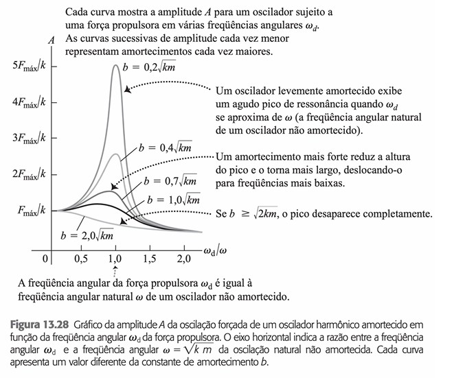

---
Classification	        :	Formula-Based Exercise
Discipline				:	FIS087 FOO
Source					:	2025-1 Lista 1
Description				:	L1-Q12
---

# Proposition

Uma força propulsora variando senoidalmente é aplicada a um oscilador harmônico amortecido.
a) Quais são as unidades da constante de amortecimento $b$?
b) Mostre que a grandeza $\sqrt{k\,m}$ possui as mesmas dimensões de $b$.
c) Em termos de $F_{\max}$ e de $k$, qual é a amplitude para $\omega = \sqrt{k/m}$ quando
    i) $b = 0{,}2\,\sqrt{k\,m}$ e
    ii) $b = 0{,}4\,\sqrt{k\,m}$? Compare seus resultados com a Figura 13.28.

# Step-by-step

# Answer

# Attempts

2025-03-27T06:00:00Z 0
2025-04-02T06:00:00Z 0
