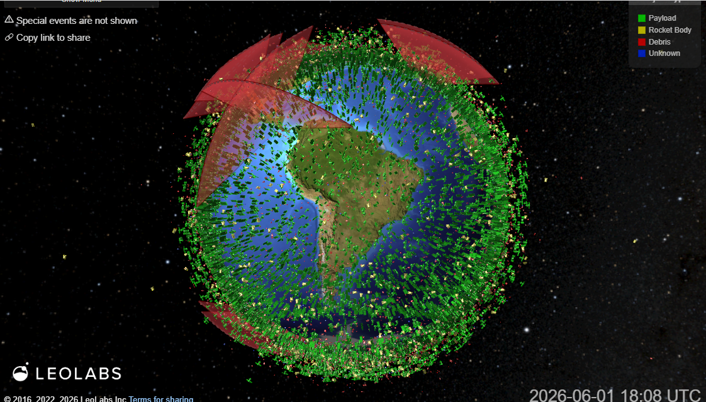
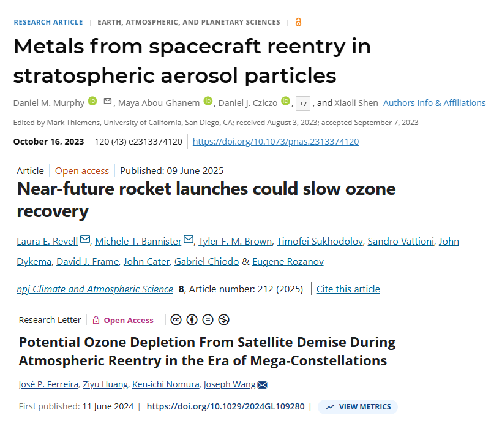
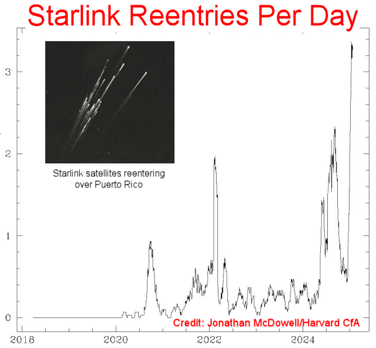
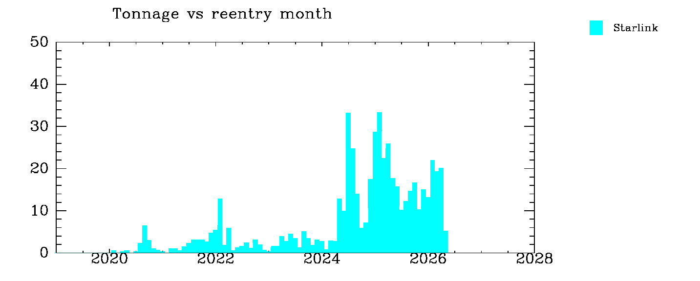
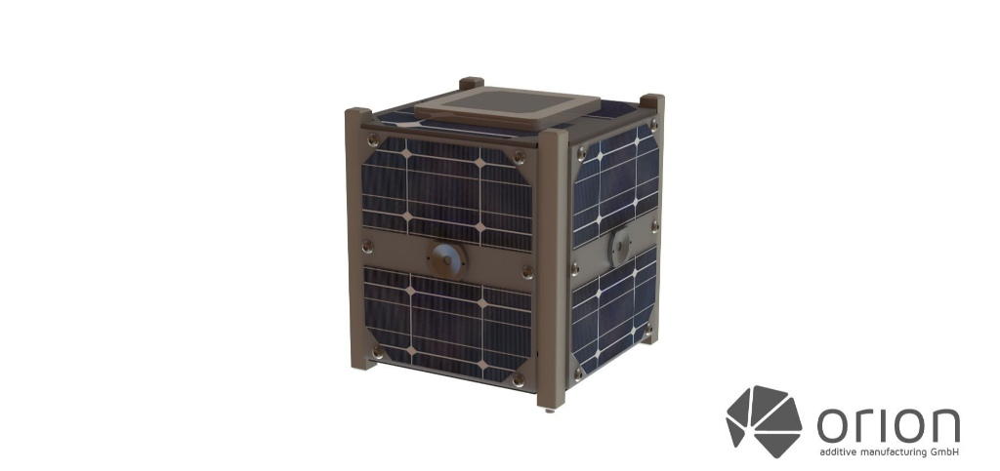
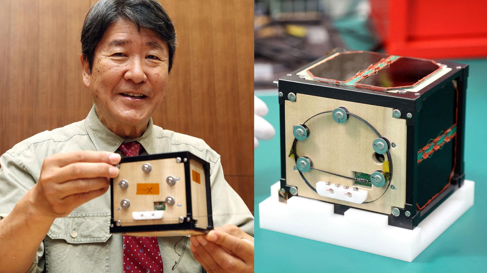

# Introdução

## O Crescimento das Constelações em LEO
- Aumento exponencial do lançamento de satélites em Órbita Baixa Terrestre (LEO).
- Megaconstelações comerciais para serviços de telecomunicações e internet global.
- Ciclo de vida curto dos satélites (geralmente de 3 a 5 anos).
- Necessidade de descarte sistemático para evitar o acúmulo de lixo espacial.

## Visualização dos satélites na baixa órbita terrestre
<!-- https://platform.leolabs.space/visualization -->
{height=100%}

## O Processo de Descarte por Reentrada
- Estratégia padrão: desorbitar o satélite ao final da vida útil.
- Indução da reentrada forçada na atmosfera terrestre.
- Dissipação da energia cinética através de atrito atmosférico extremo.
- Vaporização térmica dos componentes estruturais na alta atmosfera.

## Artigos sobre os efeitos das partículas na camada de ozônio
{height=80%}

## Satélites da Starlink reentrando na atmosfera (quantidade/dia)
<!-- https://spaceweatherarchive.com/2025/02/19/unprecedented-starlink-reentries/ -->
{height=80%}

## Satélites da Starlink reentrando na atmosfera (Toneladas/Mês)
<!-- https://planet4589.org/space/stats/figs/starmreentry.jpg -->
{height=100%}

# O Desafio dos Materiais

## Satélites de Alumínio e a Liga 7075
- O Alumínio 7075-T6 é a escolha padrão da indústria aeroespacial devido à alta razão resistência-peso.
- Excelente processabilidade e confiabilidade estrutural em ambiente espacial.
- Contudo, a combustão térmica durante a reentrada vaporiza toneladas de metal.
- Formação massiva de partículas microscópicas de óxido de alumínio ou alumina ($Al_2O_3$).

## Impacto na Estratosfera e Camada de Ozônio
- As partículas de $Al_2O_3$ permanecem em suspensão na estratosfera por décadas.
- Atuam como sítios catalisadores altamente eficientes para reações químicas heterogêneas.
- Ativação de compostos clorados que destroem de forma agressiva as moléculas de ozônio.
- Risco iminente de retrocesso na recuperação global da camada de ozônio devido ao tráfego espacial.

## A Alternativa Sintética: Polímeros Avançados (PEEK)
- O PEEK (Poli-éter-éter-cetona) é um termoplástico de altíssimo desempenho ganhando espaço na engenharia de satélites.
- Possui excelente resistência térmica, mecânica e à radiação, além de ser facilmente manufaturável (impressão 3D e usinagem).
- **Vantagem na Reentrada:** Por ser um material orgânico puro, decompõe-se termicamente de forma quase integral.
- Gera subprodutos gasosos limpos ($CO_2$ e $H_2O$), evitando a injeção de aerossóis catalíticos na estratosfera.

## Cubesat de PEEK impresso em 3D
<!-- https://orion-am.com/blog/orion-am-news-1/blog3d-printed-cubesats-peek-amcube-orion-4 -->
{height=100%}

# A Inovação do LignoSat

## O Projeto LignoSat
- Iniciativa conjunta da Universidade de Kyoto e da Sumitomo Forestry.
- Proposta disruptiva: desenvolvimento de nanossatélites com estrutura externa de madeira.
- Testes de exposição espacial realizados com sucesso na Estação Espacial Internacional (ISS).
- Seleção botânica focada na resiliência em condições extremas de vácuo e radiação.

## LignoSat
<!-- https://clickpetroleoegas.com.br/japao-surpreende-o-mundo-ao-lancar-satelite-de-madeira-de-apenas-10-cm-no-espaco-projeto-lignosat-ficou-240-dias-exposto-na-iss-resistiu-a-radiacao-e-pode-reduzir-o-lixo-espacial-gerado-afch/ -->
{height=100%}

## A Madeira de Magnólia (Hoonoki)
- Escolha ideal após rigorosos testes de estabilidade dimensional e resistência a rachaduras.
- Estrutura celular uniforme e alta rigidez específica.
- Ausência de umidade interna livre após processos de secagem aeroespacial controlada.
- Comportamento anisotrópico favorável para absorção de impactos mecânicos.

# Seleção de Materiais (Metodologia de Ashby)

## Matriz de Seleção de Materiais (Ashby)

| Material             | Densidade ($g/cm^3$) | Resistência no Vácuo | Resistência ao Oxigênio Atômico | Principal Subproduto de Queima |
| :------------------- | :------------------: | :------------------: | :-----------------------------: | :----------------------------- |
| **Alumínio 7075**    |        ~2,81         |      Excelente       |     Excelente (Passivação)      | $Al_2O_3$ (Alumina Sólida)     |
| **Polímero PEEK**    |        ~1,32         |      Excelente       |         Moderada a Alta         | $CO_2$ e $H_2O$ (Gases Limpos) |
| **Madeira Magnólia** |        ~0,50         | Alta (Estabilizada)  | Moderada (Requer Revestimento)  | $CO_2$ e $H_2O$ (Gases Limpos) |

## Matriz de Seleção (Custo e Resistência)

| Material             | Custo estimado (USD/kg) | Limite de escoamento (MPa) |
| :------------------- | :---------------------: | :------------------------: |
| **Alumínio 7075**    |         ~6 a 10         |            ~500            |
| **Polímero PEEK**    |        ~60 a 100        |         ~90 a 110          |
| **Madeira Magnólia** |         ~2 a 4          | N/A (material ortotrópico) |

Considerando as propriedades estruturais da Magnólia (a cerca de 12% de umidade), os valores técnicos catalogados são:

* **Tensão Máxima (Módulo de Ruptura em Flexão):** ~77 a 85 MPa.
* **Compressão Máxima (Paralela às Fibras):** ~37 a 43 MPa.
* **Resistência Mínima (Compressão Perpendicular):** ~6 a 9 MPa.

## Análise dos Índices de Mérito
- **Minimização de Massa:** A madeira apresenta a menor densidade absoluta, seguida pelo PEEK. Ambos superam o alumínio no índice de Ashby para painéis leves sob flexão.
- **Resistência Ambiental:** O alumínio é superior contra oxigênio atômico. O PEEK possui boa resiliência natural, enquanto a madeira exige tratamentos superficiais específicos.
- **Sustentabilidade de Ciclo de Vida:** O PEEK (sintético) e a Madeira (orgânica) empatam na queima limpa durante a reentrada ("Design for Demise"), isolando o Alumínio como o material ecologicamente problemático.

# Comportamento na Reentrada

## Mecanismo de Queima Limpa
- Tanto a madeira (celulose/lignina) quanto o PEEK (cadeias poliméricas) sofrem decomposição térmica por pirólise completa.
- Transformação direta de suas estruturas moleculares em compostos voláteis leves.
- Subprodutos gasosos principais: vapor de água ($H_2O$) e dióxido de carbono ($CO_2$).
- Ausência de resíduos particulados, óxidos metálicos ou fuligem negra na alta atmosfera.

## Superioridade Ecológica e D4D
- O conceito de *Design for Demise* (D4D) exige que o satélite queime de forma segura e limpa.
- O $CO_2$ e $H_2O$ liberados por satélites são insignificantes comparados às emissões industriais da superfície.
- A substituição do alumínio preserva a integridade fotoquímica e o balanço térmico da estratosfera.
- Materiais não-metálicos são a chave para a sustentabilidade das futuras megaconstelações.

# Conclusão

## O Futuro do Design Sustentável Espacial
- Necessidade urgente de integrar a Avaliação de Ciclo de Vida (ACV) e o impacto estratosférico no design de sistemas espaciais.
- A engenharia aeroespacial deve evoluir do desempenho técnico puro para a responsabilidade ecológica de fim de vida.
- Alternativas como o PEEK mostram que polímeros avançados podem substituir metais de forma sustentável.
- O sucesso do LignoSat quebra paradigmas, provando que até mesmo materiais de base biológica são viáveis e necessários para a exploração espacial consciente.