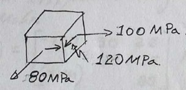

---
Classification	        :	Formula-Based Exercise
Discipline				:	EES022 Introdução à Mecânica dos Sólidos
Source					:	2025-1 Lista 2
Description				:	L2-Q1 c
---

# Proposition

Sendo $x', y', z'$ um giro de $30^\circ$, sentido anti-horário, em torno de $y$, para as componentes de tensão representadas na figura:
1. Escreva o tensor tensão em notação matricial.
2. Determine as componentes de tensão no sistema $x'$, $y'$ e $z'$ indicado.
3. Represente em forma matricial
4. Represente as componentes nas faces de um cubo (elemento do contínuo) nos eixos $x'$, $y'$ e $z'$

# Step-by-step

# Answer

$$
\sigma' = \begin{bmatrix}
198,9 & 0 & 51,3 \\
0 & 0 & 0 \\
51,3 & 0 & -18,9
\end{bmatrix}\text{ MPa}
$$

# Attempts

2025-05-08T06:00:00Z 1
